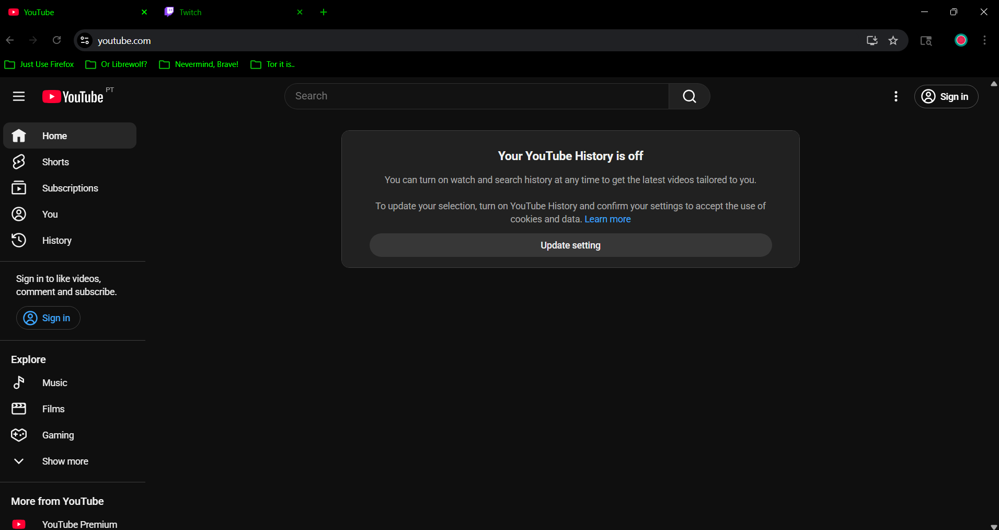

# AMOLED Terminal Green - Chrome Theme

A pure black AMOLED theme for Chrome with classic retro terminal green text. Perfect for late-night browsing and reducing eye strain on OLED displays.



## Features

- 🖤 **Pure Black (#000000)** - True AMOLED black for maximum power savings on OLED screens
- 💚 **Terminal Green (#00FF00)** - Classic retro green terminal aesthetic
- 👁️ **Easy on the eyes** - Reduced eye strain during extended browsing sessions
- ⚡ **Battery friendly** - AMOLED displays consume less power with black pixels
- 🎯 **Clear contrast** - Active and inactive tabs are easily distinguishable

## Screenshots

| New Tab | Active Browsing |
|---------|----------------|
|  |  |

## Installation

### Option 1: Local Installation (Recommended)

1. **Download or clone this repository**
   ```bash
   git clone https://github.com/yourusername/amoled-terminal-green.git
   ```

2. **Open Chrome Extensions**
   - Navigate to `chrome://extensions/`
   - Enable "Developer mode" (toggle in top-right corner)

3. **Load the theme**
   - Click "Load unpacked"
   - Select the theme folder
   - The theme will activate immediately

### Option 2: Chrome Web Store

Coming soon! (If published)

## Customization

Want to adjust the green shade? Edit `manifest.json`:

```json
"tab_text": [0, 255, 0],           // Bright green for active tabs
"tab_background_text": [0, 180, 0], // Medium green
"tab_background_text_inactive": [0, 120, 0] // Dim green for inactive tabs
```

Change the RGB values to customize:
- `[0, 255, 0]` - Bright terminal green
- `[0, 200, 0]` - Slightly dimmer
- `[0, 150, 0]` - Even dimmer
- `[50, 255, 50]` - Lighter mint green

After editing, go to `chrome://extensions/` and click the refresh icon on the theme card.

## File Structure

```
amoled-terminal-green/
├── manifest.json          # Theme configuration
├── icon.png              # 128x128px theme icon
├── README.md             # This file
└── screenshots/          # Preview images
    ├── preview.png
    ├── newtab.png
    └── browsing.png
```

## Limitations

Due to Chrome's security policies, the URL bar text color cannot be customized. All other UI elements use the terminal green color scheme.

## Compatibility

- ✅ Chrome 88+
- ✅ Chromium-based browsers (Edge, Brave, Opera, Vivaldi)
- ❌ Firefox (uses different theme format)

## Contributing

Found a bug or want to suggest improvements? Feel free to:
- Open an issue
- Submit a pull request
- Fork and create your own variant

## License

MIT License - feel free to use, modify, and distribute.

## Credits

Created with ❤️ for fans of retro terminal aesthetics and AMOLED displays.

---

**Enjoy your eyes-friendly browsing experience!** 🖥️💚
